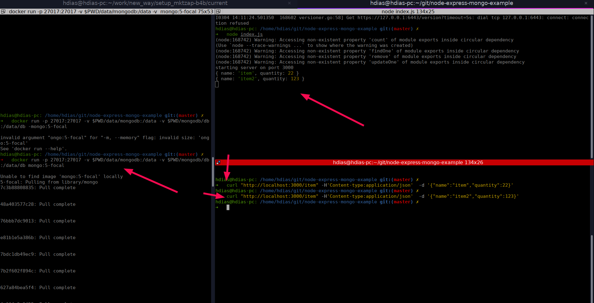
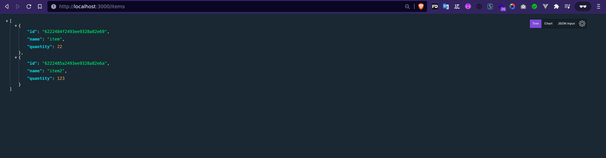
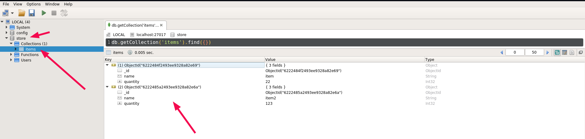

# Node Express Mongo Example
### Forked from: https://github.com/sohamkamani/node-express-mongo-example

This is a sample application demonstrating how to build an Node.js express RESTful application that integrates with MongoDB. You can see the [tutorial here](https://codetree.dev/node-rest-api-tutorial/)


# Requirements 📑📑📑
1. [Node/npm v16](https://computingforgeeks.com/how-to-install-node-js-on-ubuntu-debian/)
2. [Docker](https://docs.docker.com/get-docker/)
3. [Robot 3t](https://robomongo.org/download) (optional)

# Setup ⚙️⚙️⚙️
```
git clone https://github.com/stdioh321/node-express-mongo-example.git
cd node-express-mongo-example
npm install
docker run -p 27017:27017 -v $PWD/data/mongodb:/data -v $PWD/mongodb/db:/data/db mongo:5-focal
```
# Run 🏃🏃🏃
```
node index.js
# It will run the server at the port :3000

# Add an item to the data base
curl "http://localhost:3000/item" -H'Content-type:application/json'  -d '{"name":"item","quantity":22}'

```

Open your browser at 
### **http://localhost:3000/items**



On the **mongo** at **mongodb://localhost:27017/store?authSource=admin**


# References
*  https://github.com/sohamkamani/node-express-mongo-example